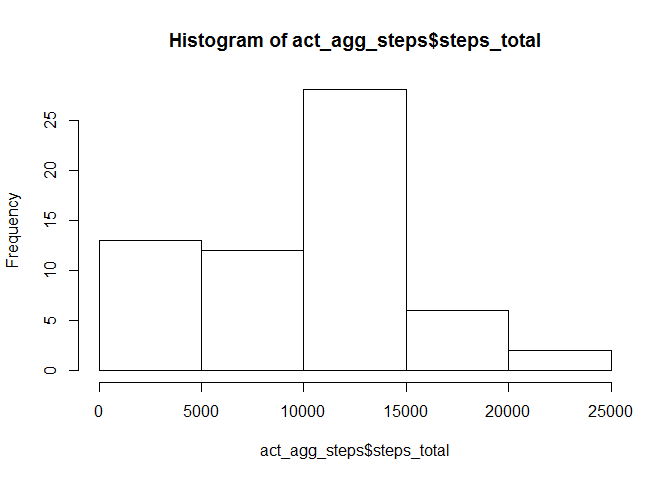
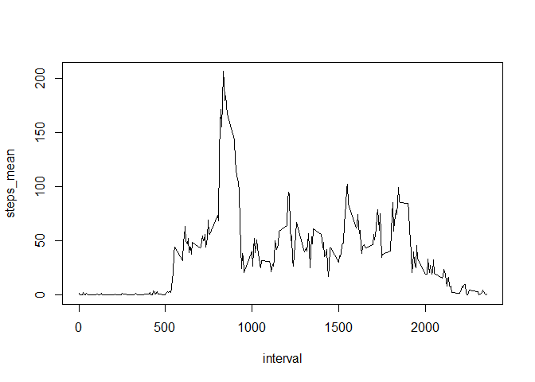
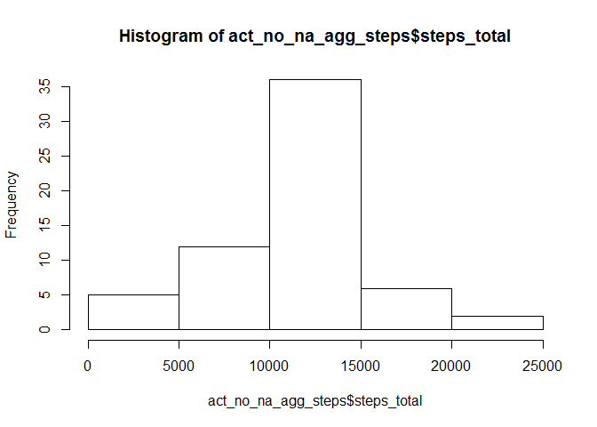
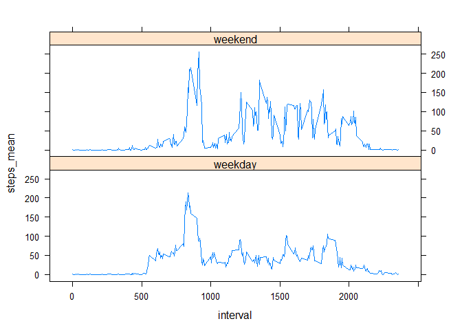

# Reproducible Research: Peer Assessment 1


## Loading and preprocessing the data

Loading the data set

```r
act <- read.csv("activity.csv")
```
Converting the column date:

```r
act$date <- as.Date(act$date, "%Y-%m-%d")
```
## What is mean total number of steps taken per day?


```r
act_agg_steps <- aggregate(act$steps,by=list(act$date),FUN=sum,na.rm=TRUE)
colnames(act_agg_steps)[2]<-"steps_total"
hist(act_agg_steps$steps_total)
```

 

The mean total numer of steps per day is:

```r
meansteps<-mean(act_agg_steps$steps_total)
meansteps
```

```
## [1] 9354.23
```
The median total numer of steps per day is:

```r
mediansteps <- median(act_agg_steps$steps_total)
mediansteps
```

```
## [1] 10395
```
## What is the average daily activity pattern?


```r
act_agg_intv <- aggregate(act$steps,by=list(act$interval),FUN=mean,na.rm=TRUE)
colnames(act_agg_intv)<-c("interval","steps_mean")
plot(act_agg_intv,type="l")
```

 


## Imputing missing values

There are 

```r
sum(is.na(act))
```

```
## [1] 2304
```
missing values in the dataset.

we replace missing values of with the average of the 5 minute interval

First we create a column in the original dataset with the average of the 5 minute interval included.


```r
act_no_na <- merge(x=act,y=act_agg_intv,by.x="interval",by.y="interval",all.x=TRUE)
```

Then we replace the na's with the average and delete the column with averages:


```r
act_no_na$steps[is.na(act_no_na$steps)]<-act_no_na$steps_mean[is.na(act_no_na$steps)]
act_no_na["steps_mean"] <- NULL
act_no_na_agg_steps <- aggregate(act_no_na$steps,by=list(act_no_na$date),FUN=sum,na.rm=TRUE)
colnames(act_no_na_agg_steps)[2]<-"steps_total"
```

We show a histogram of total number of steps per day after imputing


```r
hist(act_no_na_agg_steps$steps_total)
```

 
After the imputing the mean total numer of steps per day is now:

```r
meanstepsimp <- mean(act_no_na_agg_steps$steps_total)
meanstepsimp
```

```
## [1] 10766.19
```
After the imputing the median total numer of steps per day is:

```r
medianstepsimp <- median(act_no_na_agg_steps$steps_total)
medianstepsimp
```

```
## [1] 10766.19
```

The imputing increases the mean number of steps per days by

```r
meanstepsimp - meansteps
```

```
## [1] 1411.959
```
The imputing increases the the number of steps per days by

```r
medianstepsimp - mediansteps
```

```
## [1] 371.1887
```

## Are there differences in activity patterns between weekdays and weekends?

Determine weekday number : 

```r
act_no_na["weekdaynum"]<-as.POSIXlt(act_no_na$date)$wday
```

Add  new factor-variable 

```r
act_no_na["type_of_day"]<-sapply(act_no_na$weekdaynum,function(x) if(x<6){"weekday"} else{"weekend"} )
```

Aggregate by type of day and interval


```r
act_no_na_agg_intv <- aggregate(act_no_na$steps,by=list(act_no_na$interval,act_no_na$type_of_day),FUN=mean,na.rm=TRUE)
colnames(act_no_na_agg_intv)<-c("interval","type_of_day","steps_mean")
```


Load lattice plotting system:


```r
library(lattice)
attach(act_no_na_agg_intv)
```

Plot:

```r
xyplot(steps_mean~interval|type_of_day,type="l",layout=c(1,2))
```

 
